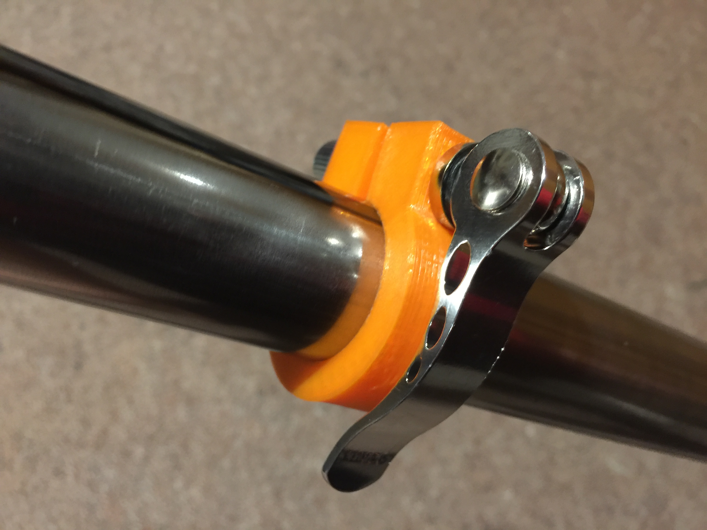

# Telescopic Tube Clamp

This repository contains parts for building telescopic tube legs. It includes a clamp designed to fit in the middle of two tubes where one is telescoping inside the other, and a foot to protect the floor.

## Motivation

I am interested in building custom furniture that suits my specific needs. One of those needs is for a standing up desk which is easily portable. This clamp mechanism allows me to create height adjustable legs for my standing up desk.

## Parts Required

The clamp is designed to fit steel suitable for table legs. However, the design is parametric so you could adjust it for other purposes.

- [32mm & 35mm external diameter steel tube](https://www.industrialtube.co.nz/products/carbon-steel-tubing).
- [Bike clamp mechanism](http://www.aliexpress.com/item/Outdoor-Bicycle-Aluminium-Alloy-Quick-Release-Bike-Seat-Post-Clamp-Seatpost-Skewer-Bolt-Mountain-Bike-Seat/32505480822.html)

## Instructions

### Clamp

The clamps are easy to print and require almost no assembly. If you purchased the above bicycle clamps, make sure you remove the internal flanges before fitting.

### Foot

The foot should be printed with 80%+ infill in order to be strong.

## Contributing

1. Fork it
2. Create your feature branch (`git checkout -b my-new-feature`)
3. Commit your changes (`git commit -am 'Add some feature'`)
4. Push to the branch (`git push origin my-new-feature`)
5. Create new Pull Request

## License

Released under the MIT license.

Copyright, 2016, by [Samuel G. D. Williams](http://www.codeotaku.com/samuel-williams).

Permission is hereby granted, free of charge, to any person obtaining a copy
of this software and associated documentation files (the "Software"), to deal
in the Software without restriction, including without limitation the rights
to use, copy, modify, merge, publish, distribute, sublicense, and/or sell
copies of the Software, and to permit persons to whom the Software is
furnished to do so, subject to the following conditions:

The above copyright notice and this permission notice shall be included in
all copies or substantial portions of the Software.

THE SOFTWARE IS PROVIDED "AS IS", WITHOUT WARRANTY OF ANY KIND, EXPRESS OR
IMPLIED, INCLUDING BUT NOT LIMITED TO THE WARRANTIES OF MERCHANTABILITY,
FITNESS FOR A PARTICULAR PURPOSE AND NONINFRINGEMENT. IN NO EVENT SHALL THE
AUTHORS OR COPYRIGHT HOLDERS BE LIABLE FOR ANY CLAIM, DAMAGES OR OTHER
LIABILITY, WHETHER IN AN ACTION OF CONTRACT, TORT OR OTHERWISE, ARISING FROM,
OUT OF OR IN CONNECTION WITH THE SOFTWARE OR THE USE OR OTHER DEALINGS IN
THE SOFTWARE.
